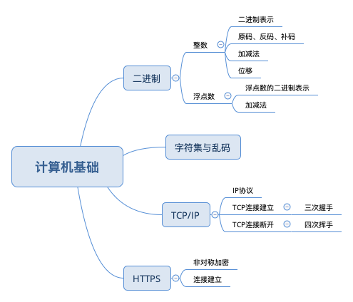

## 第一章 计算机基础



----

### 1. 二进制
整数

* 二进制表示 <br />
  二进制即逢二进一，在电路板中用高低电平来表示0，1 <br />
  1条电路只能表示两种状态：0 或 1，故1条电路最多只能表示2个数字，范围是十进制的0..1 <br/>
  2条电路可以表示4 (2的2次方) 种状态：00, 01, 10, 11. 故2条电路最多可以表示4个数字，范围是十进制的0..3 (0 到 2^2-1) <br />
  8条电路可以表示256 (2的8次方) 种状态，故8条电路最多可以表示256个数字，范围是十进制的0..255 (0 到 2^8-1) <br />
  8条电路在计算机中表示8 bits. 8 bits = 1 Byte<br />
  Java中byte 类型变量占1个字节 (1 Byte = 8 bits), 表示的范围是从 -128..127 <br />
  
  *Q1： 刚才说到8条电路就是8 bits，他的范围是0..255，那byte也是8 bits，为什么他的范围不是 0..255，反而是-128..127？* <br />
  A1: 
  - 因为负数本身是一个很常见的情况，那对于8条电路来说，怎么表示负数呢？
  - 8条电路, 我们规定最左侧的一条表示正负，0表示正数，1表示负数。这条电路不参与数值表示。
  - 那么8条电路的最大值就是： 0-1111111 (1个0表示正数，7个1表示数值)。7个1所代表的最大数值是 +127
  - 那么8条电路的最小值就是： 1-1111111 (1个1表示负数，7个1表示数值)。7个1所代表的最小数值是 -127
  - 你可能会问，这个范围不是 -127..127 吗？-128怎么来的？
  - 在Java中，数字都是以补码的形式存储的。正数的补码和他的原码、反码是一样的；负数的补码等于他的反码+1；
  - 127的原码反码补码为 0111-1111.
  - -128补码的计算方式为，取出128的原码1000-0000，逐位取反得到0111-1111，加1之后又变为了 1000-0000
  - 因为所有的数字都是以补码形式存在，那么当计算机看到1000-0000的时候，他就是指-128, 而不是128.
  - 128的二进制是1000-0000，这个是不能用8 bits来表示的，因为他跟-128会发生歧义。
  - [这里有具体的解释](https://stackoverflow.com/questions/3621067/why-is-the-range-of-bytes-128-to-127-in-java)
  
  
* 原码 反码 补码 <br />
正数的补码和他的原码、反码是一样的；负数的补码等于他的反码+1；<br />
举例来说：35的原码、反码、补码是：0010-0011 <br/>
-35<br />
原码是：1010-0011<br />
反码是：1101-1100<br />
补码是：1101-1101<br />

-35的补码的另外一个解法：求得35的原码，逐位取反，然后加1，得到跟上面的结果是一样的。

* 加减运算

计算机内部用补码存储的一个好处就是，减法也可以用补码的加法来实现。比如

```
  00100011 --> 35
+ 11011011 --> -37 (补码)
----------
  11111110 --> -2 (补码)
```

* 位移运算

带符号位移 << >> <br />
带符号位移表示符号位参与移动。这种情况下，只有负数右移的情况高位补1，其他情况（包括正数左移、右移；负数的左移）都是空位补0 <br />
负数右移：因为负数的最高位是符号位，用1表示负数。当右移之后，应该保持符号位不变。<br />
右移: -35 右移1位: 1101-1101 >> 1 = 1110-1110 (补码), 再取补码得到: 1001-0010 = -18 (近似除以2) <br />
正数右移: 35. 0010-0011 >> 1 = 0001-0001 = 17 (近似除以2) <br />

其他情况比如: 负数左移, -35 << 1 = -70. 他的计算过程如下:
-35 的补码是: 1101-1101 左移一位, 空位补0, 结果为: 1011-1010, 注意此处的结果为补码. 想得到他所表示的数字需要取反再加1(补码的补码等于原码)
1011-1010 取反 = 1100-0101 加1 = 1100-0110 = -70. <br />

正数左移: 35左移1位: 0010-0011 << 1 = 0100-0110 = 70. <br />
总体来说在不溢出的情况下,左移1位相当于乘以2; 右移1位近似除以2<br />
正数左移的结果可能是正数也可能是负数; 负数左移的结果可能是负数也可能是正数.<br />

比如byte 类型的 64左移一位: 0100-0000 << 1 = 1000-0000 = -128 (正数左移得到负数)<br/>
-96左移一位: 1010-0000 << 1 = 0100-0000 = 64 (负数左移得到正数)


无符号位移 >>> <br />
注意不存在 <<< 无符号左移. <br />
在无符号右移的情况下,符号位和正常的数字一样,一起参与移动. 无论是正数还是负数.高位直接补0. <br />
对于int(32位)来说,右移1位的结果等于右移33位的结果.也就是说右移的实际位数是 n%32. <br/>
同理,对于 long(64位) 来说, 右移1位等于右移65位,右移5位等于右移69位. 也就是说实际位数是 n%64 <br />


### 2. 浮点数
