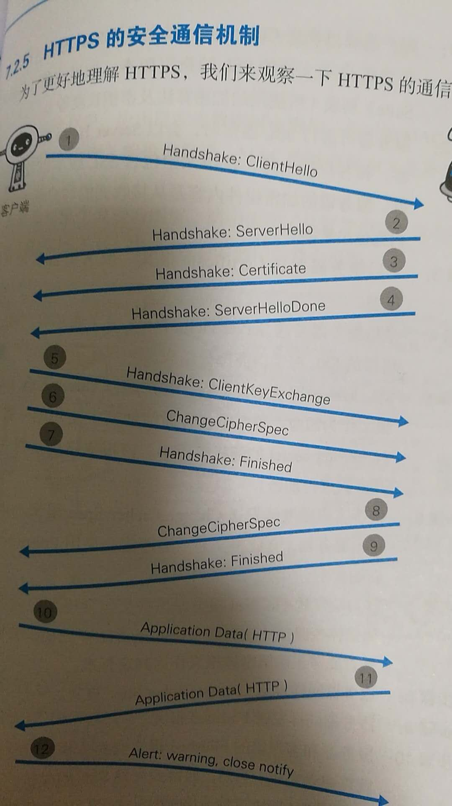
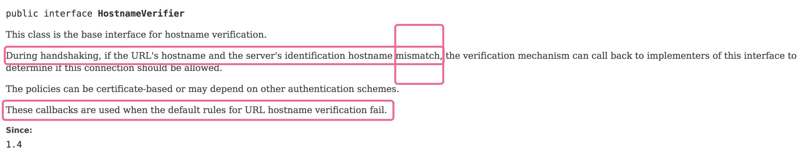

### 到底要不要调用 setHostnameVerifier?

先说说 HostnameVerifier 是个什么东西吧。

不过在说这个之前还得做个铺垫：Https 连接建立过程：



其中第三步，服务器端把证书发给了客户端。

在这之后，且在客户端发送请求之前，客户端会对这个证书做验证，看这个证书是否是合法证书。

验证过程大致是这样：
1. 用数字证书认证机构的公钥对这个证书中的数字签名进行验证

2. 如果验证通过，则说明证书是真实有效的证书颁发机构颁发的（颁发的过程其实是CA-Certificate Authority用自己的私钥对申请者的公钥进行数字签名的过程）
3. 然后，客户端还会检查当前访问的URL中的主机(host)在没在这个证书所授权的域名列表中，如果在，则通过。如果不在，还是会验证失败，这个host name的验证用来解决 A 网站上部署了 B 网站的证书的问题。
4. 而这个主题中的 setHostnameVerifier就跟上面这步对host的检查相关
5. 下面来具体说下


分两个情况： Java 和 Android

* Java

先看下Java中对`HostnameVerifier`接口的说明：




```
public interface HostnameVerifier
This class is the base interface for hostname verification.
During handshaking, if the URL's hostname and the server's identification hostname mismatch, the verification mechanism can call back to implementers of this interface to determine if this connection should be allowed.

The policies can be certificate-based or may depend on other authentication schemes.

These callbacks are used when the default rules for URL hostname verification fail.
```

大致意思是说，在Https建立过程中(during handshaking), 如果访问的那个host跟服务器端证书中标记的host不匹配的话，就会调用这个方法来进行host有效性的验证。并且(第三段中)当默认的host验证规则验证失败的时候会执行这个回调方法。

那么我理解，也就是说，HttpsURLConnection 自己本身就有一个[DefaultHostnameVerifier](https://android.googlesource.com/platform/libcore/+/2496a68/luni/src/main/java/javax/net/ssl/DefaultHostnameVerifier.java)，并实现了根据证书去检查host的验证规则, 如果这个验证成功了就不会调用自定义的这个`HostnameVerifier`了。

写一段程序测试：

这个程序是通过HttpsURLConnection访问www.baidu.com.

并且在访问之前调用了 `HttpsURLConnection.setDefaultHostnameVerifier(hv);` 来设定 HostnameVerifier.

那么如果自定义的 HostnameVerifier 的 verify 方法没有被调用则说明默认的那个 DefaultHostnameVerifier 是返回true的。

```
import java.net.*; 
import java.io.*; 
import javax.net.ssl.*; 
 
/**
 * 用Java调用 HttpsURLConnection 来请求网页。
 * @author wliu
 */
public class SimpleHttpsURLConnectionExample { 
  public static void main(String args[ ])throws Exception { 
    try { 
    
        URL url = new URL("https://www.baidu.com");


        HostnameVerifier hv = new HostnameVerifier() {
            @Override
            public boolean verify(String host, SSLSession ssls) {
                //throw new UnsupportedOperationException("Not supported yet."); //To change body of generated methods, choose Tools | Templates.
                System.out.println("host == " + host);
                return false;
            }
        };
        System.out.println("hv == " + hv);
        HttpsURLConnection.setDefaultHostnameVerifier(hv);
        
        HttpsURLConnection connection = (HttpsURLConnection) url.openConnection();
        HostnameVerifier chv = connection.getHostnameVerifier();
        System.out.println("chv == " + chv);
        connection.connect();
        
        // read the output from the server
      BufferedReader reader = new BufferedReader(new InputStreamReader(connection.getInputStream()));
      StringBuilder stringBuilder = new StringBuilder();

      String line = null;
      while ((line = reader.readLine()) != null)
      {
          System.out.println("line = " + line);
        stringBuilder.append(line + "\n");
      }
        System.out.println(stringBuilder.toString());
    } catch(IOException e) {
        e.printStackTrace();
    } 
  } 
} 
```

运行结果是 这个www.baidu.com 正常访问但HostnameVerifier里面的verify方法没有被执行。

我们去掉 `HttpsURLConnection.setDefaultHostnameVerifier(hv);` 运行结果也是一样的。

* Android
	* HttpsURLConnection: 我认为如果在Android里面直接使用HttpsURLConnection的话行为应该是跟Java中一样的 -- 不过我没有写代码在Android平台测试。。
	* OKHttp: 

	代码如下：
	```
	OkHttpClient client = new OkHttpClient.Builder()
                .addInterceptor(interceptor)
                .hostnameVerifier(new HostnameVerifier() {
                    @Override
                    public boolean verify(String s, SSLSession sslSession) {
                        Log.e("XX", "s == " + s);
                        return false;
                    }
                })
                .build();
	```
	
	基于这个OKHttp的配置访问https页面的时候会抛出异常。
	
	相反，去掉对 `hostnameVerifier` 的设定则会请求成功。
	
	
-
综上说明， 一般情况下 HostnameVerifier 是不需要设定的；

但是当：
* 你访问的服务器上部署的证书不是直接颁发给你的服务器的时候 - 比如证书是颁发给 www.baidu.com, 但你现在是访问的是 image.baidu.com，那么这个情况你可以在代码中设定你自己的 HostnameVerifier 来对host进行验证
* 或者是在开发环境中 你访问的服务器可能都没有域名，直接用IP访问，而这个IP又不是证书中授权的域名列表对应主机的IP，那么你可以自定义 HostnameVerifier 来进行自定义的验证规则

除此之外，我暂时还想不到有其他原因来使用这个方法设定 host 名称的验证规则。