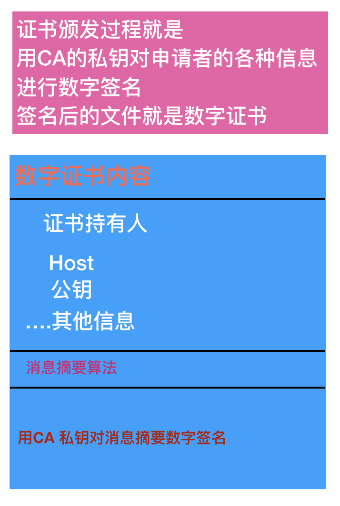

## 数字证书的颁发过程
1. 申请者将自己的身份信息（可以想象成身份证），公司信息，以及自己生成的非对称密钥对中的公钥等信息一起交给证书签发机构（CA）
2. CA 选择一种消息摘要算法对步骤1中的数据计算出来消息摘要
3. CA 用自己的私钥，对步骤2中的消息摘要进行数字签名
4. 把步骤3中的消息签名，以及步骤2中的消息摘要算法，以及步骤1中的身份信息等数据，一并写入到某个文件中，这个文件就是数字证书
5. 申请者拿到数字证书之后部署到自己的网站上用于https访问服务

## 客户端对数字证书的验证过程

1. 首先验证证书签发机构是否合法。拿到证书之后 查看证书中的根签发机构是否在浏览器或OS中，如果没有则验证失败
2. 如果证书签发机构验证成功，则用证书中的消息摘要算法（公开算法）对证书中的 持有人、host、公钥、其他信息 等数据计算出来消息摘要
3. 然后用证书签发机构的公钥（已经是存在于OS或浏览器中），对证书中的“用CA私钥对消息摘要数字签名”这部分内容进行解密，如果解密成功则会得到颁发证书时生成的消息摘要 -- 这一步已经可以确认这个证书确实是CA颁发的
4. 用步骤3中的消息摘要内容跟步骤2中的消息摘要内容进行对比，一致则说明证书中的内容比如证书持有人 、 host等信息没有被篡改过。
5. 对浏览器来说，他需要进一步验证正在请求的网站的域名是否与证书中的host一致（或是否在证书的授权域名列表中，因为一个证书可以对应多个域名，比如 baidu.com, baifubao.com 他们是同一个证书），一致或在列表中则说明证书确实是颁发给这个网站的，可以放心访问。