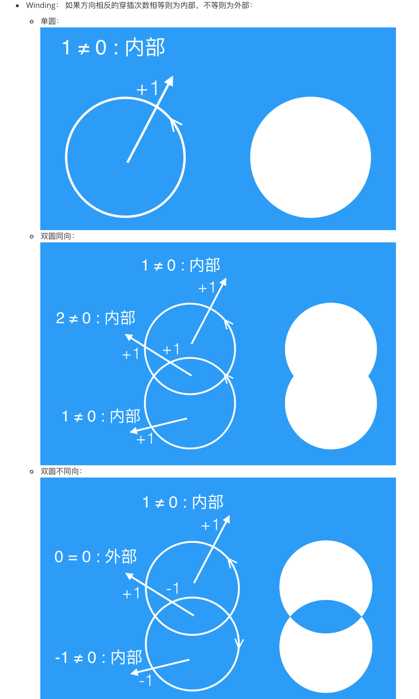
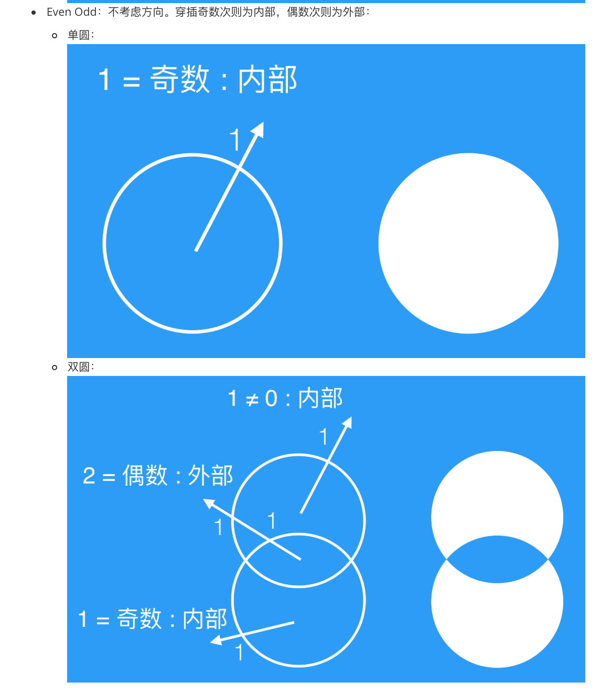
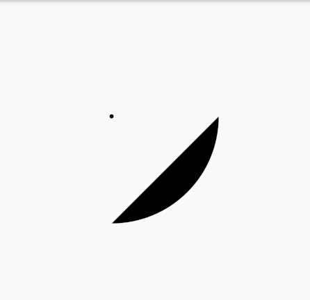
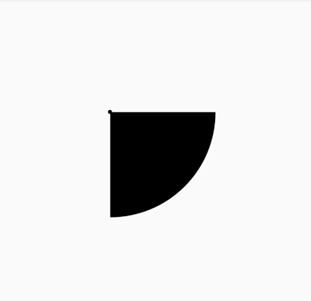
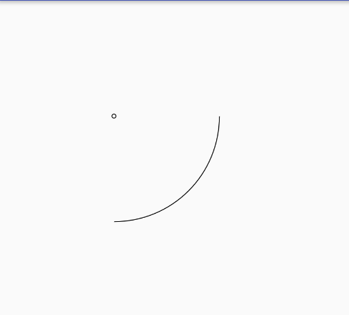
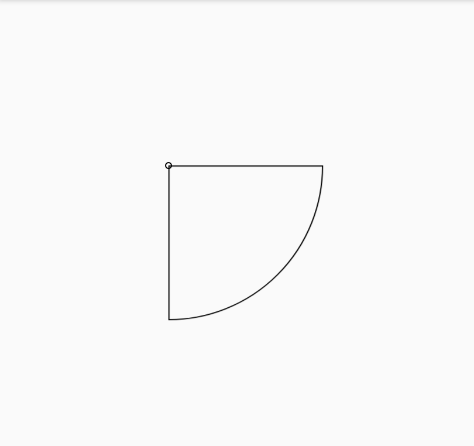

#### lesson06 容易混淆的和一直不清楚的东西总结

----

#### 1. Important packages and classes
* android.graphics
	- Canvas
	- Path
		- Path.Direction.CCW (counterclockwise) / Direction.CW (clockwise)
		- Path.FillType.EVEN_ODD / Path.FillType.WINDING
	- Paint
		- Paint.Style.FILL / Paint.Style.STROKE
		- Paint.setXferMode(new PorterDuffXfermode(PorterDuff.Mode.SRC_IN...))
	- PorterDuffXfermode

* android.util
	- TypedValue

	
#### 2. 关于 Path.FillType.WINDING / EVEN_ODD 的工作方式
* 方向相关性
	- WINDING 与 Path.addXX(..., Direction direction) API中最后一个参数Direction是有关系的，而EVEN_ODD是与Direction没有关系的
* 内部、外部的计算方式
	- 从任意一点往path限定的范围的任意方向发射线, 查看射线与所添加路径的交叉点
		- WINDING：方向相关：关注的是交叉点处穿过射线的方式（从左还是从右面穿过）以及总和，左面穿过+1，右面穿过-1，最终为0，则表示外部，不为0则表示内部。
		- EVEN_ODD：方向无关：关注的是交叉点的个数，奇数表示内部，偶数为外部
* 内部、外部的绘制
	- 内部为填充paint的颜色
	- 外部则不填充

* 扔物线讲解：





#### 3. 关于 canvas.drawArc 中的 useCenter 与 Paint Style的关系和执行效果
* 首先 Paint 如果不setStyle的话，他默认的style是 FILL

FILL + false (useCenter = false):


FILL + true:




STROKE + false:




STROKE + true:




```
 @Override
 protected void onDraw(Canvas canvas) {
        super.onDraw(canvas);

        int cx, cy;
        cx = cy = (int) (padding + width / 2);
        canvas.drawCircle(cx, cy, 5, paint);

        canvas.drawArc(padding, padding, padding + width, padding + width,
                0, 90, false, paint);
}
```

#### 4. 关于 paint.setXfermode() 

* Xfermode is `TransferMode`
* `PorterDuffXfermode` 是 `Xfermode` 唯一的子类

用 `PorterDuffXfermode` 实现蒙版效果

```
paint.setXfermode(new PorterDuffXferMode(Mode.SRC_IN))
```

`SRC_IN` 的用法示例

```
canvas.drawCircle(xx)

paint.setXfermode(new PorterDuffXferMode(Mode.SRC_IN)) // 蒙板，上面画出来的相当于是确定了显示范围，后面画出来的内容只有与上面重叠的范围才会显示

canvas.drawBitmap(bitmap) 
```

圆形头像示例代码：

```
@Override
    protected void onDraw(Canvas canvas) {
        super.onDraw(canvas);

        Path path = new Path();
        path.addCircle(cx, cy, radius , Path.Direction.CCW);
        paint.setColor(Color.RED);
        canvas.drawPath(path, paint);

        int saveCount = canvas.saveLayer(left, top, right, bottom, paint); // 使用Xfermode设置蒙板必须配合离屏缓冲！-- not sure how 离屏缓冲 works like for now....
        path.reset();
        path.addCircle(cx, cy, radius - radius / 15 , Path.Direction.CCW);
        canvas.drawPath(path, paint);

        paint.setXfermode(new PorterDuffXfermode(PorterDuff.Mode.SRC_IN));

        Bitmap bitmap = getAvatar(this.width);
        canvas.drawBitmap(bitmap, left, top, paint);
        canvas.restoreToCount(saveCount);
    }
```


圆形图片 -- 范围裁切方式实现：

```
        // 圆形图片 -- 范围裁切方式实现
		 canvas.save();
        Path path = new Path();
        path.addCircle(cx, cy, radius, Path.Direction.CCW);
        canvas.clipPath(path);
        Bitmap bitmap = getAvatar(this.width);
        canvas.drawBitmap(bitmap, left, top, paint);
        canvas.restore();
```


