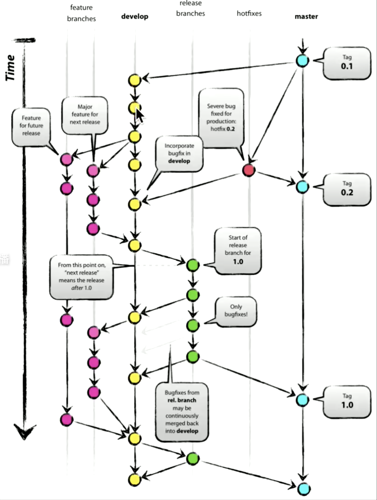

### Git 交互式Add

* git add -i // 交互式add

* git diff --staged

* git commit -a -m "commit message here" // -a 是add， -m是加message

-----

* git tag tag_1 // 创建一个tag
	- 不能移动的branch。
	- HEAD 不能指向 tag

* git push origin tag_1

----

#### HEAD 的移动历史

* git reflog
* git checkout HEAD@{3}
* git reflog master
* git chckout master@{0} // 前一个记录

git reset branch --hard

----

cherry-pick // 把指定的commit合并到master

git cherryp-pick commit#1 commit#2

----

#### Git Flow

* Github Flow
	1. 开branch来做开发
	2. 然后把branch推到远端
	3. 提交Pull Request
	4. Merge 到master

* Git Flow - Git 工作流

	
----

#### Git 分布式

* Fork - 把某个远端服务器上的仓库上pull一个版本到自己的本地仓库，然后把自己的本地仓库放到另外一个远端服务器